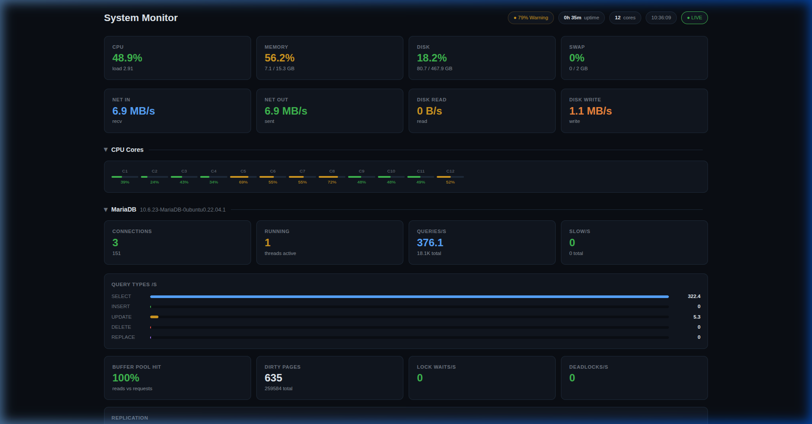

## Frappe System Monitor

A real-time system monitor for Frappe/ERPNext: CPU, memory, disk, network, MariaDB, Redis, background workers, active users, and recent errors — pushed live over a websocket, with an HTTP polling fallback.

#### License

MIT

## USAGE
- bench get-app https://github.com/3srys/vitals
- bench --site sitename install-app frappe_system_monitor
- bench restart
- login
- open yoururl.com/system_monitor

The dashboard is a website page (not a Desk page), so it's served directly at `/system_monitor` on your site.

### Live updates (websocket)

`ws_server.py` is a standalone process that polls system + MariaDB metrics every ~0.9s and broadcasts them to every connected browser tab over a websocket (port `8765` by default, override with `WS_MONITOR_PORT`).

To start the WebSocket monitor daemon in the bench directory, run:
```bash
./env/bin/python apps/frappe_system_monitor/ws_server.py 1>> logs/ws_monitor.log 2>> logs/monitor.error.log &
```

If the WebSocket server isn't running or the websocket can't connect, the page falls back to polling `server_status()` over HTTP every 900ms — this works but each open browser tab polls independently, so it costs more DB load with several tabs open. The header shows a **LIVE** (websocket) or **POLLING** (HTTP fallback) indicator so you can tell which mode you're in.

### What's on the dashboard

- CPU (total, per-core, user/system/iowait breakdown), memory, swap, disk usage & I/O, network throughput, load average, process counts
- **MariaDB**, in depth: connections, uptime, QPS/slow-queries, query-type breakdown, InnoDB buffer pool hit rate & usage, InnoDB row operations & disk I/O, row locking & deadlocks, handler stats, query cache, table/file cache usage, replication status, and a **live process list** (filterable, auto-excludes the monitor's own `SHOW FULL PROCESSLIST` query)
- ERPNext scheduler status, background workers, queued/failed jobs, pending emails
- Redis memory/connections/keys
- systemd service status (nginx, mariadb, redis, supervisor, bench workers)
- Active user sessions and recent error logs

### Notes

- Requires the `System Manager` role.
- `ws_server.py` connects to MariaDB directly (via `pymysql`) using credentials from `site_config.json`, independent of the Frappe request stack — this keeps the live push cheap and working even under web-worker load.
- `SHOW FULL PROCESSLIST` is the one metrics query whose cost scales with connection count; on servers with very high connection counts, expect it to be somewhat more expensive than the other status/variable queries (which are all in-memory and effectively free).



